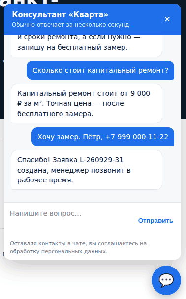
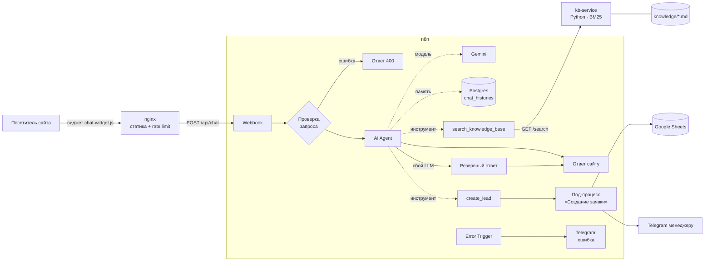

# ИИ-консультант для сайта на n8n

Онлайн-консультант для сайта компании, который отвечает посетителям по базе знаний, собирает заявки на замер и передаёт их менеджеру в Telegram и Google Sheets. Проект собран на **n8n** (оркестрация и AI Agent), **Gemini API** (бесплатный тариф), **Python/FastAPI** (сервис базы знаний) и **JavaScript** (встраиваемый виджет). Запускается одной командой через Docker Compose.

Для демонстрации используется вымышленная компания «Кварта» (ремонт квартир в Санкт-Петербурге). Все названия, адреса и телефоны вымышлены.

<p align="center"></p>

<sub>Скриншот сделан на тестовом стенде `tests/e2e`: ответы модели там эмулируются заглушкой, остальная цепочка (nginx → n8n → агент → инструменты → заявка → Telegram) работает по-настоящему. С реальным ключом Gemini текст ответов формулирует модель.</sub>

## Что умеет

- **Отвечает только по базе знаний.** Агент перед каждым ответом вызывает инструмент поиска. Если ответа в базе нет, он не придумывает цены и сроки, а предлагает связаться с менеджером.
- **Помнит контекст диалога.** История хранится в Postgres отдельно для каждой сессии: последние 10 сообщений, поэтому данные не теряются при перезапуске.
- **Оформляет заявку.** Узнаёт имя и телефон, приводит номер к формату `+7XXXXXXXXXX`, проверяет его, записывает заявку в Google Sheets и отправляет карточку менеджеру в Telegram.
- **Устойчив к сбоям.** Если бесплатный лимит LLM исчерпан (429) или модель недоступна, посетитель получает понятный ответ с телефоном, а не ошибку 500. Если одна из систем (таблица или Telegram) недоступна, заявка всё равно сохраняется через вторую.
- **Защищает лимит и данные.** nginx ограничивает частоту до 6 сообщений в минуту с одного IP. Входные данные проверяются до вызова LLM. Текст в виджете и в Telegram экранируется (защита от XSS и HTML-инъекций). Промпт запрещает раскрывать инструкции и выходить за тему.
- **Сообщает об ошибках.** Отдельный workflow присылает в Telegram уведомление о любом сбое.

## Архитектура



| Компонент | Технология | Назначение |
|---|---|---|
| `site/widget/chat-widget.js` | JavaScript без зависимостей | Встраиваемый виджет: подключается одной строкой `<script>` |
| `nginx/default.conf` | nginx | Отдаёт сайт, проксирует `/api/chat` в n8n (без CORS), ограничивает частоту запросов |
| `n8n/workflows/01_site_chat_agent.json` | n8n AI Agent + Gemini | Основной диалог: проверка, агент, инструменты, резервный ответ |
| `n8n/workflows/02_create_lead.json` | n8n | Под-процесс заявки: нормализация, Google Sheets, Telegram |
| `n8n/workflows/03_error_alert.json` | n8n | Уведомления об ошибках в Telegram |
| `kb-service/` | Python, FastAPI | Поиск по базе знаний (BM25, русский стемминг) |
| `n8n/init/` | Node.js, shell | Автоматический импорт учётных данных и workflow при запуске |

## Быстрый старт

Нужны Docker, Docker Compose и бесплатный ключ Gemini API из [Google AI Studio](https://aistudio.google.com/apikey).

```bash
git clone https://github.com/GiitEnjoyer/ai-consultant-n8n-gemini.git
cd ai-consultant-n8n-gemini
cp .env.example .env        # укажите GEMINI_API_KEY, пароли и (по желанию) Telegram
docker compose up -d --build
```

После запуска:

- демо-сайт с виджетом: <http://localhost:8080>;
- редактор n8n: <http://localhost:5678> (при первом входе создайте учётную запись владельца, после чего workflow и учётные данные будут уже на месте);
- API базы знаний: <http://localhost:8000/docs>.

Контейнер `n8n-init` при первом запуске сам импортирует учётные данные из `.env` и три workflow, а затем публикует их. Ручная настройка в интерфейсе не требуется.

### Telegram и Google Sheets

1. **Telegram.** Создайте бота у [@BotFather](https://t.me/BotFather), укажите `TELEGRAM_BOT_TOKEN` и ID чата менеджера в `TELEGRAM_MANAGER_CHAT_ID`. Менеджер должен хотя бы раз написать боту.
2. **Google Sheets** (необязательно). Создайте таблицу с листом `Leads` и заголовками `Дата | Номер заявки | Имя | Телефон | Запрос | Источник | Сессия`. Затем создайте сервисный аккаунт в Google Cloud, скачайте JSON-ключ в `secrets/google-service-account.json`, выдайте сервисному аккаунту доступ «Редактор» к таблице и укажите `GOOGLE_SHEET_ID`.

После изменения `.env` выполните `docker compose up -d`: учётные данные обновятся автоматически.

## Как адаптировать под другой бизнес

1. Замените файлы в `kb-service/knowledge/`. Разметка — обычный Markdown, каждый раздел `##` становится отдельным фрагментом. Изменения применяются без пересборки: `curl -X POST localhost:8000/reload -H "X-Admin-Token: $KB_ADMIN_TOKEN"`.
2. Измените системный промпт в узле «ИИ-консультант» (название компании, правила квалификации лида).
3. Подключите виджет на свой сайт:

```html
<script src="https://ваш-домен/widget/chat-widget.js"
        data-endpoint="/api/chat"
        data-title="Консультант"
        data-greeting="Здравствуйте! Чем помочь?"
        data-quick="Цены|Сроки|Связаться с менеджером"
        defer></script>
```

## Тестирование

Проект проверяется на трёх уровнях.

| Уровень | Что проверяется | Запуск |
|---|---|---|
| Модульные тесты Python | Разбиение базы знаний, релевантность поиска, отсечение нерелевантных вопросов, API | `cd kb-service && pip install -r requirements-dev.txt && pytest` |
| Модульные тесты workflow | JavaScript-код узлов Code берётся прямо из JSON-файлов workflow: валидация запроса, нормализация телефонов, экранирование, различение ошибок 429 и прочих сбоев, согласованность связей | `cd n8n && npm install && npm test` |
| Сквозной тест без ключей | Вся цепочка в настоящем n8n: заглушки Gemini и Telegram в `tests/e2e/mock_services.py` детерминированно вызывают инструменты и позволяют смоделировать ошибку 429 | см. ниже |
| Оценка качества ответов | Контрольные вопросы к реальной модели: факты из базы, отказ отвечать без данных, посторонние темы, попытка подмены инструкций | `python scripts/eval_dialogs.py --url http://localhost:8080/api/chat` |

Сквозной тест без расхода лимита LLM:

```bash
python tests/e2e/mock_services.py 9911
# в .env: GEMINI_API_KEY=test
#         GEMINI_API_HOST=http://host.docker.internal:9911
#         TELEGRAM_BOT_TOKEN=123:test
#         TELEGRAM_API_BASE_URL=http://host.docker.internal:9911
docker compose up -d
touch /tmp/mock429   # смоделировать исчерпание лимита, rm — вернуть
```

Модульные тесты и проверка `docker-compose.yml` выполняются в GitHub Actions (`.github/workflows/ci.yml`).

## Бесплатный тариф Gemini: ограничения

- Лимиты бесплатного тарифа считаются на проект Google Cloud и меняются со временем. На момент написания для моделей Flash это порядка 10 запросов в минуту; актуальные значения показаны в разделе Rate limits в [AI Studio](https://aistudio.google.com).
- Одно сообщение посетителя обычно требует 2–3 обращений к модели: решение о вызове инструмента и итоговый ответ. Поэтому бесплатного тарифа хватает на демонстрацию и небольшой трафик. Для рабочего сайта нужен платный тариф или другая модель: узел Gemini заменяется на OpenAI, Anthropic, Groq или локальную Ollama без изменений в остальной схеме.
- На бесплатном тарифе Google может использовать запросы для улучшения моделей, поэтому персональные данные реальных клиентов лучше обрабатывать на платном тарифе.
- Модель по умолчанию — `models/gemini-2.5-flash`; её можно сменить в узле «Gemini».

## Проектные решения

- **Поиск BM25 вместо векторной базы.** Для базы знаний из десятков страниц полнотекстовый поиск с русским стеммингом даёт достаточную точность, не расходует лимиты эмбеддингов, работает детерминированно и покрывается тестами. Совпадения только по общим словам («сколько стоит») не считаются релевантными. API сервиса (`GET /search`) не зависит от реализации, поэтому BM25 можно заменить на Qdrant или pgvector, не трогая n8n.
- **Заявка оформлена отдельным под-процессом.** Его можно вызывать не только из агента, но и из формы на сайте или из Telegram-бота. Логика валидации тестируется отдельно.
- **Учётные данные и настройки берутся из `.env`.** Workflow не содержат ключей и ID чатов, поэтому JSON безопасно хранить в Git.
- **Один origin для сайта и API.** nginx проксирует `/api/chat`, поэтому CORS не нужен, а webhook n8n не открыт наружу напрямую (порт 5678 привязан к `127.0.0.1`).

## Структура репозитория

```
├── docker-compose.yml         # postgres, kb-service, n8n-init, n8n, nginx
├── .env.example
├── n8n/
│   ├── workflows/             # 3 workflow для импорта в n8n
│   ├── init/                  # автоимпорт учётных данных и workflow
│   └── tests/                 # тесты кода узлов Code
├── kb-service/                # Python-сервис базы знаний
│   ├── app/                   # FastAPI, BM25, нормализация текста
│   ├── knowledge/             # база знаний в Markdown
│   └── tests/
├── site/                      # демо-сайт и виджет
├── nginx/default.conf
├── scripts/eval_dialogs.py    # проверка качества ответов модели
└── tests/e2e/mock_services.py # заглушки Gemini и Telegram
```

## Возможные доработки

- передача диалога живому оператору через Telegram (ответы менеджера возвращаются в виджет);
- интеграция с CRM (amoCRM, Bitrix24) вместо Google Sheets;
- панель аналитики диалогов: частые вопросы и вопросы без ответа для пополнения базы знаний;
- потоковая выдача ответа в виджете (streaming).
